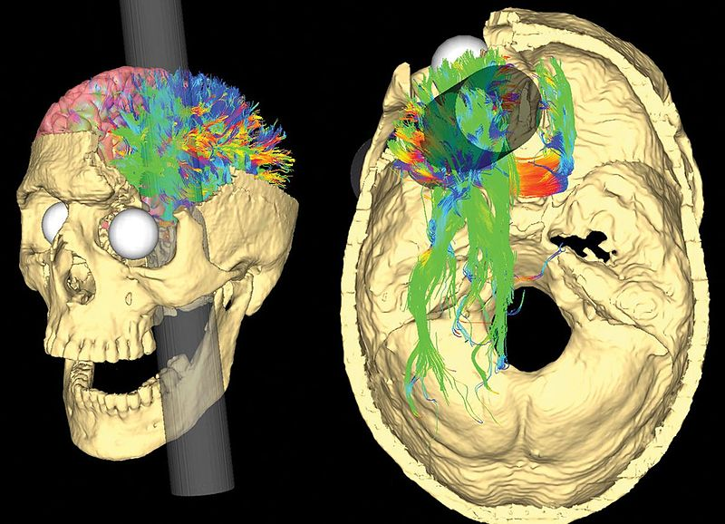
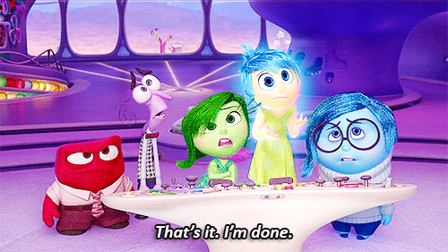
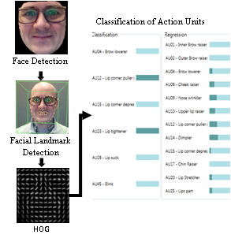
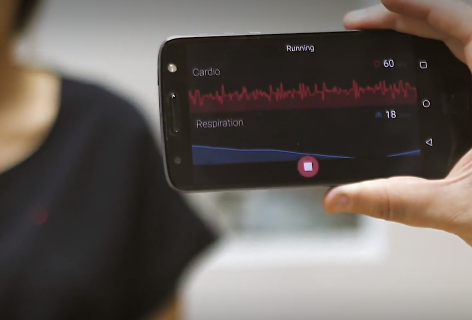

```{r setup, include = FALSE}
# libraries --------------------------------------------------------------------
library(tidyverse)
library(knitr)
library(nomnoml)
library(here)
library(janitor)
library(mgcv)
library(gratia)
library(htmltools)
library(plotly)
library(zoo)
library(dygraphs)
library(tweetrmd)
library(fontawesome)

# general options --------------------------------------------------------------
options(scipen = 999)
set.seed(123)
# chunk options ----------------------------------------------------------------
opts_chunk$set(
  cache.extra = rand_seed, 
  message = FALSE, 
  warning = FALSE, 
  error = FALSE, 
  echo = FALSE,
  cache = FALSE,
  comment = "", 
  fig.align = "center", 
  fig.retina = 3
  )


# theme ------------------------------------------------------------------------
# library(xaringanthemer)
# style_xaringan(code_font_google = google_font("IBM Plex Mono"))
# style_duo(primary_color = "#1F4257", secondary_color = "#F97B64")
```

layout: true
  
<div class="custom-footer"><span>Disenchantment with Emotion Recognition Technologies - Dupré (2022) </span></div>

---

# My Journey into Emotion Science

#### Developement of the DynEmo Facial Expression Database (Master)

* Dynamic and spontaneous emotions
* Assessed with self-reports and by observers

#### Analysis of Emotional User Experience of Innovative Tech. (Industrial PhD)

* Understand users' acceptance of technologies from their emotional response
* Based on multivariate self-reports

#### Evaluation of Emotions from Facial and Physiological Measures (Industrial PostDoc)

* Applications to marketing, sports and automotive industries
* Dynamic changes with trend extraction techniques (2 patents)

#### Performance Prediction using Machine Learning (Academic PostDoc)

* Application to sport analytics
* Big Data treatment (> 1 million users with activities recorded in the past 5 years)

---
class: inverse, mline, center, middle

# 1. A Closer Look at Emotion Science

---

# Why Measuring Emotional Experiences?

The emotional experience determines our perceptions and leads our decisions:

* In every life (e.g., the Phineas Gage Case; see also [Bechara, Damasio, & Damasio, 2000](https://doi.org/10.1093/cercor/10.3.295))
* In consumer behaviours (e.g., emotions are trigged from product designs and can facilitate buying decisions; [Mahlke & Minge, 2008](https://doi.org/10.1007/978-3-540-85099-1_5); [Bloch, 1995](https://doi.org/10.1177/002224299505900302))

```{r out.width='60%'}

```
.center.tiny[Modeling the path of the tamping iron through the Gage skull and its effects on white matter structure.<br />Credit: Van Horn, Irimia, Torgerson, Chambers, Kikinis & Toga (2012) [`r emo::ji("link")`](https://doi.org/10.1371/journal.pone.0037454)]

---

# What Emotions are?

> *“Everyone knows what an emotion is, until asked to give a definition. Then, it seems no one knows.”* - [Fehr & Russell (1984, p. 464)](https://doi.org/10.1037/0096-3445.113.3.464) 

```{r}
tags$video(
  controls = "true",
  src = "./media/emotion_elicitation.mp4", 
  type = "video/mp4", 
  width = "400",
  height = "400",
  style = "display:block; margin: 0 auto;"
  )
```
.center.tiny[K-fee commercial. Credit: Cobblestone Filmproduktion (2004) [`r emo::ji("link")`](https://www.youtube.com/watch?v=sA_wUTLhSAU)]

---

# Characteristics of Emotions

.left-column[
```{r out.width='27%'}

```

```{r out.width='27%'}

```

```{r out.width='27%'}
include_graphics("media/emo_sync.png")
```

```{r out.width='27%'}

```

```{r out.width='27%'}

```

```{r out.width='27%'}
include_graphics("media/emo_intensity.png")
```

```{r out.width='27%'}
include_graphics("media/emo_rapidity.png")
```

.center.tiny[Adapted from Scherer (2005) [`r emo::ji("link")`](https://doi.org/10.1177/0539018405058216)]

]

.right-column[

]

--

### Event Focus

--

### Appraisal Driven

--

### Response Synchronization

--

### Rapidity of Change

--

### Behavioural Impact

--

### Intense Response

--

### Short Duration

---

# What Emotions are not?

Affective states refer to **"valenced (good versus bad) states"** ([Gross, 2010, p. 212](https://doi.org/10.1177/1754073910361982)):

* Attitudes are **relatively stable beliefs about the goodness or badness of something or someone**

* Moods are **less stable than attitudes**, and unlike attitudes, often **do not have specific objects**

* Emotions are **the shortest** lived of these three affective processes. They are responses to situations that are perceived as **relevant to an individual’s current goals**

```{nomnoml, fig.width=12, fig.height=3}
#stroke: blue
#direction: down
#align: center
[Affective States]->[Attitudes]
[Affective States]->[Emotions]
[Affective States]->[Moods]
```

.center.tiny[There are many types of affective states, including attitudes, moods, and emotions.<br />Adapted from Gross (2010) [`r emo::ji("link")`](https://doi.org/10.1177/1754073910361982)]

---

# Holistic Definition of Emotions

> Emotion is defined as *“an **episode of interrelated, synchronized changes** in the states of **all or most of the five organismic subsystems** in **response to the evaluation of an external or internal stimulus** event as relevant to major concerns of the organism”.* - [Scherer (2001, p. 93)](https://global.oup.com/academic/product/appraisal-processes-in-emotion-9780195130072)

--

```{r out.width='80%'}

```
.center.tiny[Inside Out. Credit: Pixar Animation Studios (2015) [`r emo::ji("link")`](https://i.imgur.com/ifdEAOx.gif)]

---

# Functions of Emotions

Emotions have 5 functions each corresponding to a specific component/subsystem:

* Evaluation of objects and events (**Cognitive Component**)
* System regulation (**Physiological Component**)
* Preparation and direction of action (**Motivational Component**)
* Communication of reaction and behavioural intention (**Motor/Expressive Component**)
* Monitoring of internal state (**Subjective Feeling Component**)

--

```{nomnoml, fig.width=12, fig.height=4}
#stroke: blue

[Emotion|
  [Cognitive Component]->[Motivational Component]
  [Cognitive Component]->[Physiological Component]
  [Cognitive Component]->[Expressive Component]
  [Motivational Component]->[Subjective Component]
  [Physiological Component]->[Subjective Component]
  [Cognitive Component]->[Subjective Component]
  [Expressive Component]->[Subjective Component]
]

[<abstract>Trigger Event]--:>[Emotion]
```

.center.tiny[The dynamic architecture of the component process model.<br />Adapted from Scherer (2009) [`r emo::ji("link")`](https://doi.org/10.1080/02699930902928969)]

---

# Developement of Affective Computing

Despite the usefulness of the Component Process Model, research on emotions have lead to a "conceptual and definitional chaos" ([Buck, 1990, p. 330](https://doi.org/10.1207/s15327965pli0104_15)):

* There is still no consensual agreement between researchers
* Some assumptions of the broad audience are not supported by scientific evidences

.pull-left[
In parallel, multiple tools and databases have been developed to investigate emotions. With the **increase in computer processing power** and the **development of machine learning algorithm**, computer scientists have created models to automatically recognize emotions... 

**What Could Possibly Go Wrong?**
]

.pull-right[
```{r out.width='80%'}
include_graphics("media/rise_affective_computing.png")
```
.center.tiny[Credit: The Guardian (2019) [`r emo::ji("link")`](https://www.theguardian.com/technology/2019/mar/06/facial-recognition-software-emotional-science)]
]

---
class: inverse, mline, center, middle

# 2. Emotion Recognition from Facial Expressions and Physiological Changes

---
class: title-slide, middle

## 2.1 Measuring Emotions from Facial Expression

---

# Current Methods

![:col_header Type, Measure, Tool]
![:col_row Invasive, Electric Activity of Face Muscles, Facial Electromyography (fEMG)]
![:col_row Non-Invasive, Human Observer Visual Recognition, Manual Annotation Software]
![:col_row Non-Invasive, Landmark Spatial Configuration, Automatic Recognition Classifiers]

```{r out.width='75%'}
include_graphics("media/affectiva.jpg")
```
.center.tiny[Credit: Affectiva [`r emo::ji("link")`](https://www.affectiva.com/news-item/affectiva-launches-multi-modal-automotive-in-cabin-ai-to-improve-road-safety-and-accelerate-autonomy-2/)]

---

# Automatic Facial Expression Recognition

Development of the technology:

* First attempt by reported by [Suwa, Sugie, & Fujimura (1978)](https://books.google.ie/books?id=P4s-AQAAIAAJ)
* Numerous academic systems since (see revue by [Zeng, Pantic, Roisman, & Huang, 2009]())
* VicarVision to develop the first commercial automatic classifier ([den Uyl & van Kuilenburg, 2005](http://www.vicarvision.nl/pub/fc_denuyl_and_vankuilenburg_2005.pdf))
* Today more than 20 companies for applications to automotive, sport, health, human resources, security or marketing purposes ([Dupré, Andelic, Morrison, & McKeown, 2018](https://doi.org/10.1109/PERCOMW.2018.8480127))

.pull-left[
A process in 3 steps:

* Face Detection
* Facial Landmark Detection
* Classification

Result is a recognition probability for a labelled category (e.g., Action Unit, Basic Emotion, Dimensions)
]

.pull-right[
```{r out.width='70%'}

```
.center.tiny[Credit: Dupré, Andelic, Morrison & McKeown (2018) [`r emo::ji("link")`](https://doi.org/10.1109/PERCOMW.2018.8480127)]
]

---

# Facial Expression Categorization

Emotion categories/dimensions are inferred from facial expressions either:

.pull-left[
* Directly, by matching Action Units to prototypical expressions of emotions (Emotion coded by the FACS; [Ekman, Friesen, & Hager, 2002](https://www.paulekman.com/facial-action-coding-system/))

```{r out.width='85%'}
include_graphics("media/emfacs_example.jpg")
```
.center.tiny[Credit: Bartlett, Littlewort, Frank, Lainscsek, Fasel, & Movellan (2006) [`r emo::ji("link")`](https://www.doi.org/10.1109/FGR.2006.55)]

]

.pull-right[
* Indirectly, by generalizing features learnt from training with specific databases (pictures or video, posed or spontaneous)

```{r out.width='42%'}

```
.center.tiny[Credit: ThinkApps [`r emo::ji("link")`](http://thinkapps.com/blog/development/machine-intelligence-affectiva-interview/)]

]

```{r}
data_expression <- "data/automatic_recognition_data.csv" %>% 
  here::here() %>% 
  readr::read_csv() %>% 
  janitor::clean_names() %>% 
  dplyr::select(source, time_stamp, joy, fear, disgust, sadness, anger, surprise) %>% 
  tidyr::pivot_longer(
    cols = joy:surprise, 
    names_to = "emotion_recognized", 
    values_to = "value"
  ) %>% 
  tidyr::separate(source, c("emotion_expressed", "gender"), sep = "[.]") %>% 
  dplyr::mutate(type = case_when(
    emotion_recognized == emotion_expressed ~ "target",
    TRUE ~ "non-target"
  )) 
```

---

# Example of Automatic Recognition (1)

Four video clips expressed by males were taken from the [DynEmo database](https://dynemo.univ-grenoble-alpes.fr/?lang=en) and judged by human observers as expressing happiness, surprise, fear and disgust:

```{r, eval=params$eval_rights, fig.show="hold", out.width='25%', fig.align="default"}
include_graphics("../../../Media/dynemo_disgust_m.gif")
include_graphics("../../../Media/dynemo_fear_m.gif")
include_graphics("../../../Media/dynemo_happiness_m.gif")
include_graphics("../../../Media/dynemo_surprise_m.gif")
```

```{r, fig.width=11, fig.height=3}
plot <- data_expression %>%
  dplyr::filter(gender == "M") %>% 
  ggplot(aes(time_stamp, value, color = emotion_recognized)) + 
  geom_line(size = 2) +
  scale_x_continuous("") +
  scale_y_continuous("") +
  scale_color_discrete("Emotion Recognized") +
  facet_grid(gender ~ emotion_expressed) + 
  theme(legend.position = "bottom")

plotly::ggplotly(plot) %>%
  layout(legend = list(orientation = "h", x = 0.4, y = -0.2))
```

.center.tiny[Expression of Disgust correctly recognized, the others led to subtle or incorrect recognition.]

---

# Example of Automatic Recognition (2)

Four video clips expressed by females were taken from the [DynEmo database](https://dynemo.univ-grenoble-alpes.fr/?lang=en) and judged by human observers as expressing happiness, surprise, fear and disgust:

```{r, eval=params$eval_rights, fig.show="hold", out.width='25%', fig.align="default"}
include_graphics("../../../Media/dynemo_disgust_f.gif")
include_graphics("../../../Media/dynemo_fear_f.gif")
include_graphics("../../../Media/dynemo_happiness_f.gif")
include_graphics("../../../Media/dynemo_surprise_f.gif")
```

```{r, fig.width=11, fig.height=3}
plot <- data_expression %>%
  dplyr::filter(gender == "F") %>% 
  ggplot(aes(time_stamp, value, color = emotion_recognized)) + 
  geom_line(size = 2) +
  scale_x_continuous("") +
  scale_y_continuous("") +
  scale_color_discrete("Emotion Recognized") +
  facet_grid(gender ~ emotion_expressed) + 
  theme(legend.position = "bottom")

plotly::ggplotly(plot) %>%
  layout(legend = list(orientation = "h", x = 0.4, y = -0.2))
```

.center.tiny[All four expressions are partially correctly recognized but some non relevant emotions are also recognized.]

---
class: title-slide, middle

## 2.2 Measuring Emotions from Physiological Changes

---

# Physiology and Emotions

Emotions modulate and influence physiological rhythms ([Kreibig, Samson, & Gross, 2013](https://doi.org/10.1111/psyp.12064)):

```{r out.width='70%'}
include_graphics("media/physio.png")
```
.center.tiny[Conceptual representation of the relationship between physiological rythms and emotions.]

---

# Current Methods

Possible measurements include:

* Heart Rate and Heart Rate Variability (with ECG, PPG, ...)
* Breathing Rate (with mechanical belt, thermal camera, wifi, ...)
* Skin Temperature (with wearable thermometer, thermal/infrared camera, laser, ...)
* Sudation (with EDA also called GSR)

--

![:col_header Wired Sensors, Wearable Sensors, Remote Sensors]
![:col_row 
```{r out.width='100%'}
include_graphics("media/sensors_wired.jpg")
```
<a href="https://doi.org/10.1109/T-AFFC.2011.15"> Credit: Koelstra et al. (2011) `r emo::ji("link")`</a>
,
```{r out.width='100%'}
include_graphics("media/sensors_wearable.jpg")
```
<a href="https://www.adinstruments.com/partners/equivital"> Credit: ADinstruments & Equivital `r emo::ji("link")`</a>
,
```{r out.width='100%'}

```
<a href="https://www.cu-bx.com/"> Credit: ContinUse Biometrics `r emo::ji("link")`</a>
]
![:col_list Multiple Wired Sensors, Watches / Wristbands / Belts / Smart Devices / ..., RGB Camera / Thermal Camera / Laser / Wifi / ...]
![:col_list Gold Standard, Lower Accuracy but Competitive, Still in Development]
![:col_list Restricted to Lab. Settings, Measures "in the wild", Long Distance (e.g. through walls)]

---

# Emotion Dimensions from Physiology

By identifying the common changes between simultaneous physiological rhythms, it is possible to reveal the underlying contribution of emotions in term of Activation/Arousal and Valence/Pleasure

```{r}
# data -------------------------------------------------------------------------
data_HR_sim <- here("data/data_HR_sim.csv") %>% read_csv()
data_BR_sim <- here("data/data_BR_sim.csv") %>% read_csv()
data_ST_sim <- here("data/data_ST_sim.csv") %>% read_csv()
data_EDA_sim <- here("data/data_EDA_sim.csv") %>% read_csv()

# prepare HR, BR and ST time-series --------------------------------------------
data_HR <- data_HR_sim %>%
  rename(value = Heartrate) %>%
  mutate(
    measure = "HR",
    time_date = as.POSIXct(time/1000, origin = "1970-01-01", tz = "Europe/London")
  )

data_BR <- data_BR_sim %>%
  rename(value = Breathing.Rate) %>%
  mutate(
    measure = "BR",
    time_date = as.POSIXct(time/1000, origin = "1970-01-01", tz = "Europe/London")
  )

data_ST <- data_ST_sim %>%
  rename(value = Skin.Temperature) %>%
  mutate(
    measure = "ST",
    time_date = as.POSIXct(time/1000, origin = "1970-01-01", tz = "Europe/London")
  )

# prepare EDA time-series ------------------------------------------------------
data_EDA <- data_EDA_sim %>%
  rename(value = EDA_100Microsimens) %>%
  mutate(
    measure = "EDA",
    time_date = as.POSIXct(time/1000, origin = "1970-01-01", tz = "Europe/London")
  )

# extract features from EDA ----------------------------------------------------
data_zoo <- loess(value ~ time, data = data_EDA, span = 0.35)
data_EDA$SCL <- data_zoo$fitted
data_EDA$SCR <- data_zoo$residuals

# center scale -----------------------------------------------------------------
data_HR_zoo <- zoo(data_HR$value, order.by = data_HR$time_date) %>% 
  scale(center = TRUE, scale = TRUE)
data_BR_zoo <- zoo(data_BR$value, order.by = data_BR$time_date) %>% 
  scale(center = TRUE, scale = TRUE)
data_ST_zoo <- zoo(data_ST$value, order.by = data_ST$time_date) %>% 
  scale(center = TRUE, scale = TRUE)
data_SCL_zoo <- zoo(data_EDA$SCL, order.by = data_EDA$time_date) %>% 
  scale(center = TRUE, scale = TRUE)

# merge and fill ---------------------------------------------------------------
data_physio <- zoo::merge.zoo(
    HR = data_HR_zoo, 
    BR = data_BR_zoo, 
    ST = data_ST_zoo, 
    SCL = data_SCL_zoo
  ) %>%
  na.approx()
```

```{r, fig.width=11, fig.height=3}
dygraph(data_physio) %>%
  dyRangeSelector() %>%
  dyOptions(colors = c("red", "blue", "orange", "green", "purple")) %>%
  dyLegend(width = 500)
```

.center.tiny[Simulation of physiological measures (5s) including Heart Rate (HR), Breathing Rate (BR), Skin Temperature (ST) and Skin Conductance Level (SCL). All measures are centred and scaled.]

```{r, fig.width=12, fig.height=2}
data_physio %>% 
  fortify.zoo() %>% 
  pivot_longer(-Index, names_to = "measure", values_to = "value") %>% 
  mutate(Index = as.numeric(Index)) %>% 
  gam(
    formula = value ~ s(Index), 
    data = .,  
    method = "REML", 
    correlation = corAR1()
  ) %>% 
  draw()
```

.center.tiny[Underlying trend behind the multivariate changes identified with a Generalized Additive Model and potentially contributing to changes in Arousal/Activation.]

---

# Example of Emotional Trends

Multivariate physiological analysis of emotions during a mountain biking experience ([Dupré, Bland, Bolster, Morrison, & McKeown, 2017](https://doi.org/10.1007/978-3-319-60822-8_4))

```{r eval=params$eval_rights}
tags$video(
  controls = "true",
  src = "../../../Media/mountain_bike_emotion.mp4", 
  type = "video/mp4", 
  width = "400",
  height = "400",
  style = "display:block; margin: 0 auto;"
  )
```

---
class: inverse, mline, center, middle

# 3. Current Challenges

---
class: title-slide, middle

## 3.1 Accuracy of Sensors

---

# Sensors in a Specific Context

Sensors are designed to measure facial expression or physiology in a controlled laboratory setting.

They may not be accurate once applied to the real world or to different context.

--

.pull-left[
Face recognition depends on:
.small[
- Face orientation (e.g., inclination, rotation)
- Face features (e.g., glasses, beard, face mask)
- Context light
- Morphological facial configurations
]

```{r out.width='100%'}
include_graphics("media/interstellar_affdex.gif")
```
.center.tiny[Interstellar by Affdex. Credit: Affectiva [`r emo::ji("link")`](https://www.youtube.com/watch?v=NsmAldoVwDs)]

]

--

.pull-right[
Physiological measures are sensitive to:
.small[
- Vibrations
- Correct positioning
- Singular genetic predispositions (e.g., morphology, sudation level, situs inversus)
]

```{r out.width='100%'}
include_graphics("media/heart_rate_pepper.gif")
```
.center.tiny[Credit: Techoob.com [`r emo::ji("link")`](https://www.youtube.com/watch?v=x2YF8a0SoNU)]

]

---

# No Accuracy Standard

The precision of devices is not monitored and no standard provides safe guards to users:

.pull-left[
* Academic benchmarks (e.g., [Bent, Goldstein, Kibbe, & Dunn, 2020](https://doi.org/10.1038/s41746-020-0226-6)) are used to support legal class-actions over misled consumers on the ability of accurately monitoring physiological changes ([Sawyer, 2019](https://doi.org/10.1080/07303084.2019.1649563))

* According a benchmark of 8 commercially available systems, the accuracy of automatic classifiers of facial expressions varies between 48% and 62% ([Dupré, Krumhuber, Küster, & McKeown, 2020](https://doi.org/10.1371/journal.pone.0231968))
]

.pull-right[
```{r out.width='100%'}
# tweetrmd::tweet_screenshot(
#   tweetrmd::tweet_url("AI__TECH", "1255878089986338816"),
#   maxwidth = 300,
#   hide_media = FALSE,
#   theme = "dark"
#   )

include_graphics("media/tweet_ai__tech.png")
```
]

---
class: title-slide, middle

## 3.2 Bias in Training Databases

---

# Limitations of WEIRD Databases

Lack of diversity when using facial expression databases with Western/White, Educated, Industrialized, Rich, and Democratic participants ([Arnett, 2008](https://doi.org/10.1037/0003-066X.63.7.602); [Raji & Buolamwini, 2019](https://doi.org/10.1145/3306618.3314244)).

Factors influencing the accuracy to recognize emotion (e.g., [Bryant & Howard, 2019](https://doi.org/10.1145/3306618.3314284); [Rhue, 2018](http://dx.doi.org/10.2139/ssrn.3281765)):
- Identity
- Gender
- Ethnicity
- Age

> *"While most users will get a spot-on result, we acknowledge that the ethnicity classifiers currently offered (Black, White, Asian, Hispanic, ‘Other’) fall short of representing the richly diverse and rapidly evolving tapestry of culture and race."* - [Brackeen (2017)](https://www.kairos.com/blog/we-ve-retired-our-diversity-recognition-app-here-s-why)

---

# Prototypical Expressions

Both facial expressions and physiological rhythms are proxies to infer emotions **based on theoretical assumptions**

.pull-left[
In the case of facial expressions, a majority of databases used to train automatic classifiers considers:
.small[
- Six emotions are universal (happiness, surprise, sadness, disgust, fear, anger)
- These 6 emotions have prototypical representations
]

As a result, automatic classifiers cannot recognize the diversity of facial expressions:
.small[
- More than 6 categories of facial expressions
- Difficulty to identify subtle and mixed expressions
]

]

.pull-right[
```{r out.width='100%'}
include_graphics("media/six_basic_emotion.jpg")
```
.center.tiny[Credit: Ekman, Friesen, & Hager (2002) [`r emo::ji("link")`](https://www.paulekman.com/facial-action-coding-system/)]
]

---

# Meaning is Context Dependent

A same facial expression can be interpreted differently according to the context in which the expression is produced

Examples of athletes' victory (e.g., raging or crying after wining; see [Martinez, 2019](https://doi.org/10.1073/pnas.1902661116))

```{r out.width='100%', fig.cap=""}
include_graphics("media/automatic_rec.png")
```
.center.tiny[Emotion recognized as 'Anger' but the context reveals an experience closer to 'Intense Joy'.]

---

# Inter-Individual Differences

For both facial expressions and physiological changes, whereas some similar patterns can be found, there is a important variability of possible responses to a same trigger event

```{r eval=params$eval_rights}
tags$video(
  controls = "true",
  muted = "true",
  src = "../../../Media/dynemo_fear_montage.mp4", 
  type = "video/mp4",
  width = "400",
  height = "400",
  style = "display:block; margin: 0 auto;"
  )
```

---

# Absence of Scientific Support

Despite the development of automatic classifiers on the idea that emotional categories can be inferred from sensors, there is **no scientific evidence** of reliable expressive and physiological patterns corresponding to emotional categories:

.pull-left[
* No one-to-one mapping between patterns and categories ([Kappas, 2003](https://doi.org/10.1007/978-1-4615-1063-5_11))
* Facial expression often communicates something other than an emotional state ([Barrett, Adolphs, Marsella, Martinez, & Pollak, 2019](https://doi.org/10.1177/1529100619832930))
]

.pull-right[
```{r out.width='100%'}
# tweetrmd::tweet_screenshot(
#   tweetrmd::tweet_url("truthbegolduk", "1152169980722655232"),
#   maxwidth = 400,
#   hide_media = FALSE,
#   theme = "dark"
#   )
include_graphics("media/tweet_truthbegolduk.png")
```
]

---
class: title-slide, middle

## 3.3 Ethical Considerations

---

# Current Challenges

With regard to what has been said, we have two problems here, and data/emotion privacy is not one of them:

.pull-left[

1. Physiological and expressive measures are prone to errors

2. Models used by automatic classifiers to categorise emotions are not reliable

Therefore, **should we use these automatic classifiers?**

]

.pull-right[
```{r out.width='80%'}

```
.center.tiny[Credit: Tech Xplore (2019) [`r emo::ji("link")`](https://techxplore.com/news/2019-12-ai-watchdogs-rips-emotion-tech.html)]
]

> *"Regulators should ban the use of affect recognition in important decisions that impact people's lives and access to opportunities. Until then, AI companies should stop deploying it."* - [AI Now Institute (2019)](https://ainowinstitute.org/AI_Now_2019_Report.html)

---

# Future Directions

Most of automatic classifiers of facial expressions have already moved from a classification in categories to a classification in dimensions such as Valence/Pleasure and Arousal/Activation:

* More reliable scientific evidences for a dimensional perspective
* Not restricted to specific patterns

.pull-left[
Additionally, errors in face and physiological measures are reducing with improved techniques and materials.

> *"All models are wrong, but some are useful"* - [Box (1979)](https://doi.org/10.1016/B978-0-12-438150-6.50018-2)

]
.pull-right[
```{r out.width='100%'}
# tweetrmd::tweet_screenshot(
#   tweetrmd::tweet_url("DigitalTrends", "1184388139395108864"),
#   maxwidth = 400,
#   hide_media = FALSE,
#   theme = "dark"
#   )


```
]

---
class: inverse, mline, left, middle


# Thanks for your attention, find me at...

[`r fa(name = "twitter")` @damien_dupre](http://twitter.com/damien_dupre)  
[`r fa(name = "github")` @damien-dupre](http://github.com/damien-dupre)  
[`r fa(name = "link")` damien-datasci-blog.netlify.app](https://damien-datasci-blog.netlify.app)  
[`r fa(name = "paper-plane")` damien.dupre@dcu.ie](mailto:damien.dupre@dcu.ie)